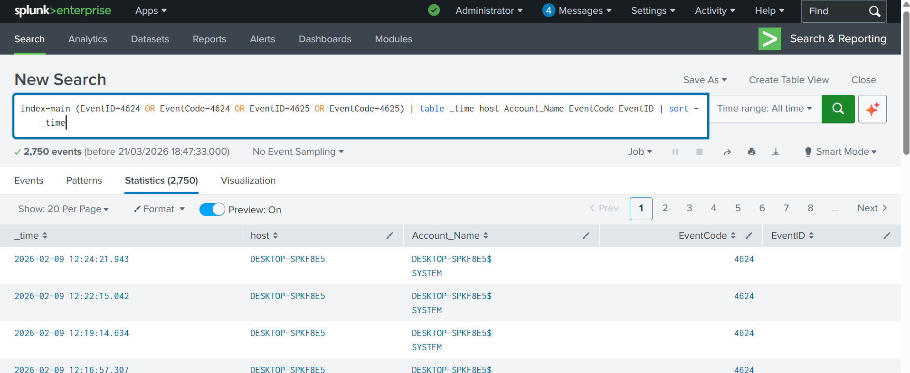
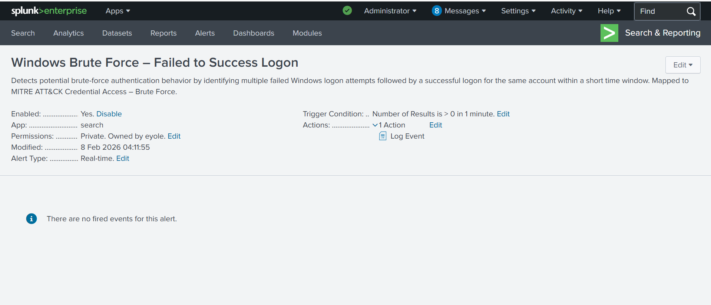
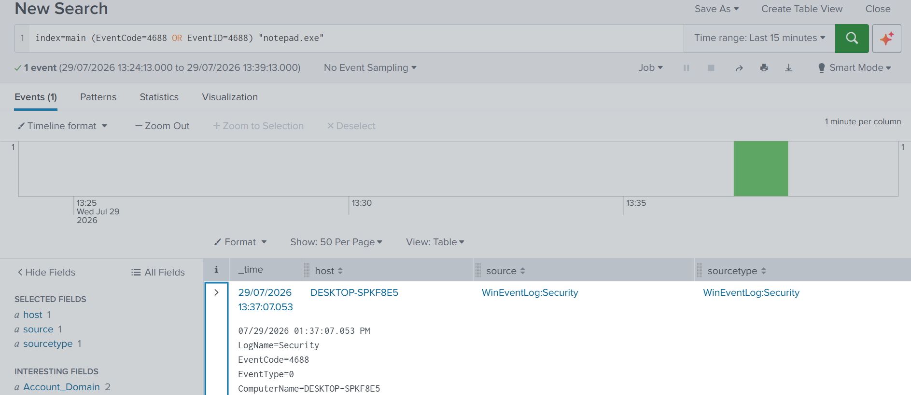
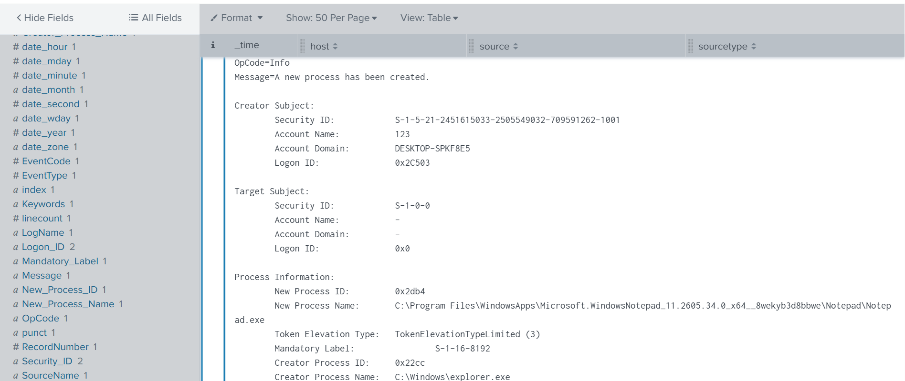
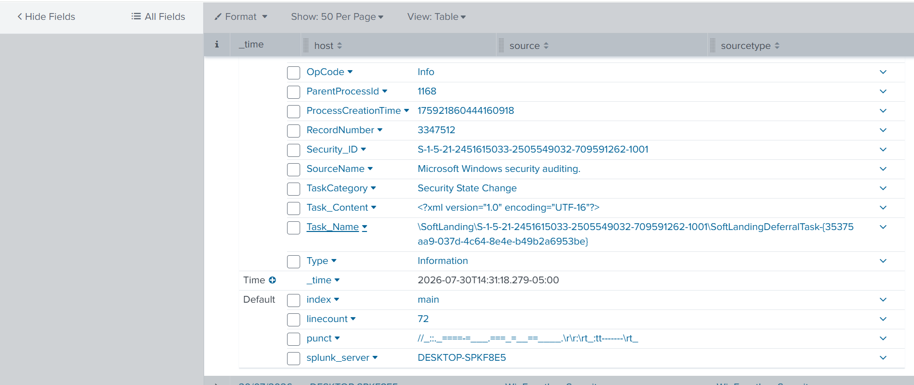
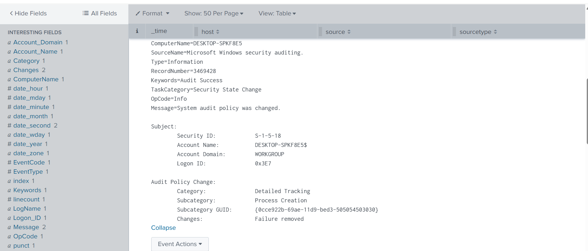
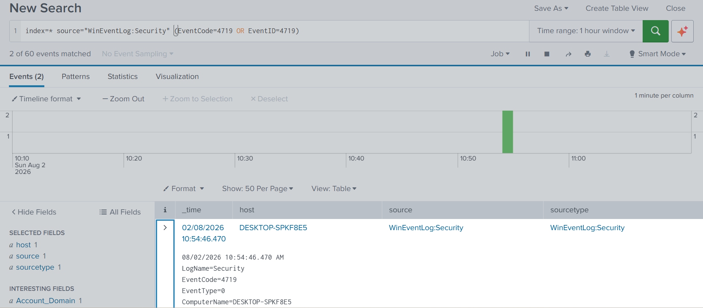
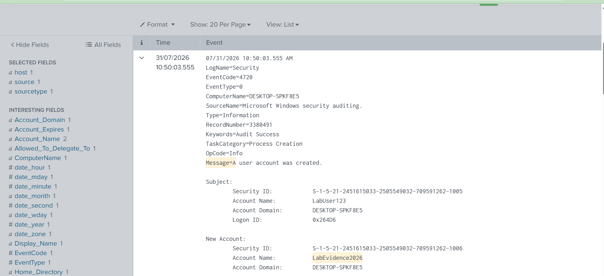
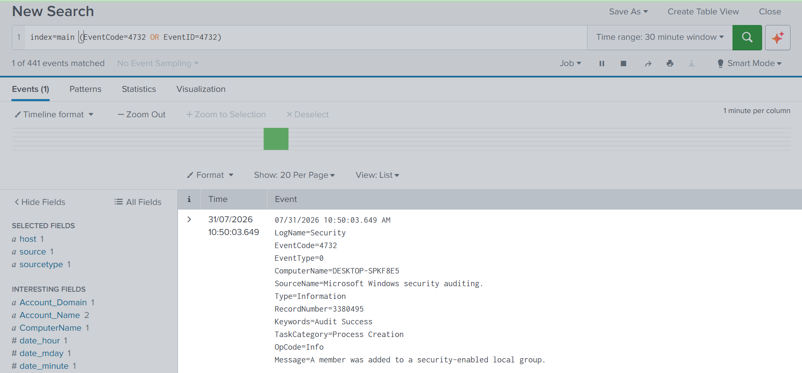
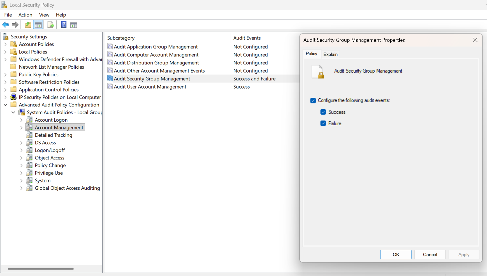

## Windows Authentication Events

Shows Windows Security Event IDs 4624 and 4625 ingested into Splunk, providing successful and failed authentication telemetry.

## Brute-Force Alert Configuration

Shows the saved Splunk alert configured to identify failed-to-successful authentication patterns.

## Process-Creation Search

Shows the Splunk search used to locate Windows Security Event ID 4688 process-creation telemetry.

## Expanded Process-Creation Event

Shows detailed process-creation information from an expanded Windows Event ID 4688.

## Scheduled-Task Creation

Shows an expanded Windows Security Event ID 4698 generated during controlled scheduled-task testing.

## Audit-Policy Modification

Shows Event ID 4719 search results confirming that audit-policy changes were ingested into Splunk.

Shows additional Event ID 4719 details from the controlled audit-policy modification.

## Local User Creation

Shows Windows Security Event ID 4720 generated during controlled creation of a local test account.

## Security-Group Membership Change

Shows Windows Security Event ID 4732 for a controlled local security-group membership change.

## Security-Group Audit Configuration

Shows the Windows audit-policy setting used to record security-group membership changes.
